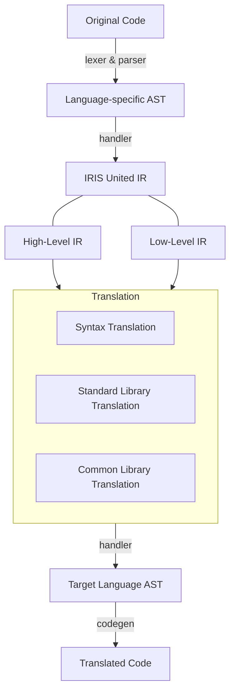

# IRIS - A Universal Code Translator

The `IRIS` project is a code translator that can convert code from one language to another. It is designed to be a universal code translator that can convert code from any language to any other language. The project is still in its early stages and only supports a few languages at the moment. The goal is to eventually support all major programming languages.

Its structure involves numerous parts:

Currently, we are working on the following languages:

- [ ] Translation between Python and JavaScript/TypeScript
- [ ] Translation between Rust and C/C++

We know that every language is irreplaceable since there's no one-size-fits-all solution. However, we believe that `IRIS` can help developers to translate code between languages more efficiently. Anyway, _just for fun_.

This project can potentially be the MIT Maker Portfolio project for me, also the Caltech STEM Portfolio.
